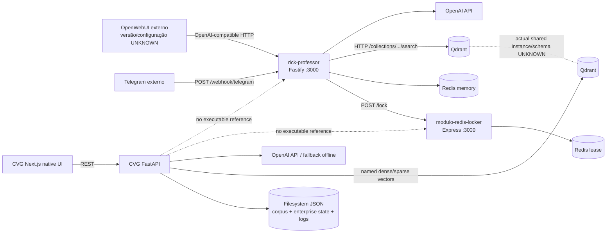
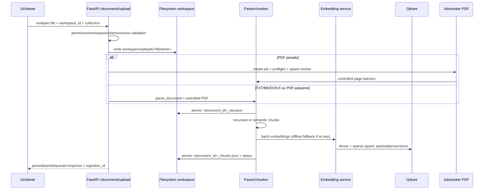
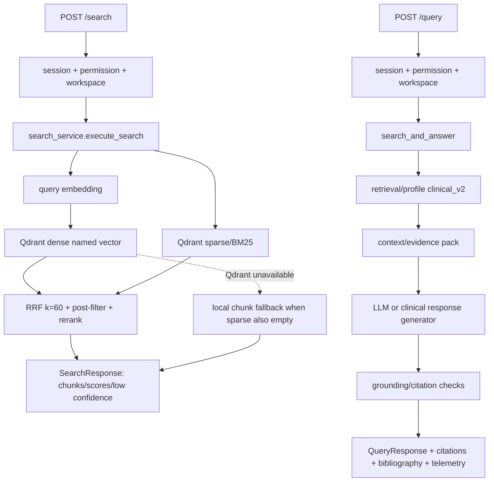
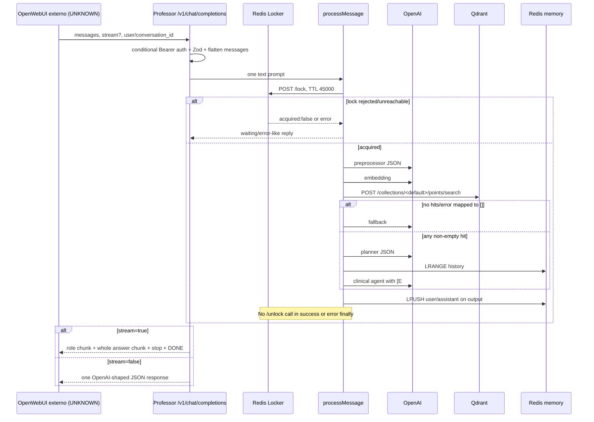

# RICK Intelligence — arquitetura atual observada

Status da evidência: `CURRENT` em 2026-08-31 UTC. Este documento descreve o
workspace como ele existe agora; não descreve a arquitetura futura como se ela
já estivesse implementada.

## Como ler este inventário

- `FACT`: confirmado diretamente em código, manifesto, configuração ou comando.
- `INFERRED`: consequência técnica razoável, ainda sem confirmação no runtime
  real.
- `HISTORICAL`: afirmação encontrada em documentação anterior; não foi usada
  como prova atual.
- `UNKNOWN/NOT_RUN`: a inspeção necessária não foi possível ou não existe
  evidência no checkout.
- `PROPOSED`: decisão de organização para uma futura Phase 1, não uma mudança
  aplicada.

Fontes de requisitos: o texto anexado ao pedido desta auditoria. Fontes de
execução: os três repositórios abaixo e os artefatos em `docs/baselines/`.

## Overlay atual da Phase 0.5

Este bloco é a fonte de verdade para as áreas alteradas desde o inventário
forense da Phase 0. As descrições conflitantes mais abaixo preservam o retrato
histórico que motivou a correção e devem ser lidas como `HISTORICAL`, não como
estado atual.

- O root já tinha uma publicação Phase 0 preservada; a Phase 0.5 mantém os três
  limites de componente e adiciona apenas mudanças locais ainda não promovidas.
- CVG e Professor compartilham o contrato lógico `rag-contract-v1`, coleção
  `rag_phase0`, vetores nomeados `dense`/`sparse`, IDs estáveis, checksum,
  versão e provenance canônica. Retries usam escopo de `workspace_id` e
  `collection_id`; o fallback em disco aplica o mesmo escopo.
- Uploads do CVG armazenam um nome gerado seguro por workspace e preservam o
  nome exibido somente como metadado. Sessões, roles canônicas, permissões
  explícitas, invalidação e ACL de coleção são aplicados no servidor.
- Respostas HTTP de sessão não devolvem bearer ao browser; o frontend usa
  cookie `HttpOnly`, enquanto o backend conserva Bearer somente para clientes
  não-browser compatíveis. Rotas administrativas não-platform ficam limitadas
  ao workspace ativo e resultados Qdrant são revalidados após a busca.
- Locker valida o owner em unlock/renew atômicos; Professor valida evidência,
  usa vetor nomeado/escopo confiável e libera/renova locks no ciclo da tarefa.
- O preflight de ingestão mantém exceções Qdrant apenas no encadeamento de
  diagnóstico do servidor; detalhes operacionais expostos ao cliente são
  estáveis e redigidos. O Locker ainda depende de isolamento/autenticação da
  rede de deployment.
- O runtime de evidência usa Python 3.12.3, Node 22.19.0, Qdrant isolado em
  `127.0.0.1:6337` e Redis isolado em `6380`; o Redis do host em `6379` não foi
  tocado. O provider real e a implantação de produção permanecem `NOT_RUN`.

## 1. Topologia real do workspace

| Componente | Git/commit observado | Stack | Papel atual | Evidência |
| --- | --- | --- | --- | --- |
| `cvg-master-rag-v2` | repo independente, `main`, `b78221793372552761c13febe36208172cf4586e` | Python 3.12/FastAPI, Qdrant, filesystem JSON, OpenAI; Next.js/React/TypeScript | candidato a produto RAG com UI web nativa, API e worker de ingestão | `src/api/main.py`, `src/services/`, `frontend/`, `src/README.md` |
| `rick-professor` | repo independente, `main`, `692290da8eb4a10fcec83dc19f358ab9643aa3a3` | Node 22/Fastify/TypeScript, OpenAI SDK, Axios, Qdrant HTTP, Redis | adapter OpenAI-compatible/Telegram com fluxo professoral | `src/server.ts`, `src/core/processor.ts`, `src/routes/` |
| `modulo-redis-locker` | repo independente, `main`, `69e7896cf783f196cf32f56b05607643811ada43` | Node 20/Express/JavaScript, ioredis, Zod | serviço HTTP de lease distribuído | `server.js`, `Dockerfile` |

O diretório raiz não tem `package.json`, `pyproject.toml`, compose, CI ou
instrução própria. O snapshot forense inicial registrou os três worktrees
limpos; a execução atual mantém alterações locais deliberadamente não
promovidas, incluindo código, testes e artefatos de controle. O inventário
aproximado é de 391 arquivos/99.802 linhas no
CVG, 25/4.103 no Professor e 7/1.183 no Locker; os números incluem documentação
versionada e servem apenas para dimensionar a superfície.

### Componentes e dependências observadas



As ligações pontilhadas são ausência de referência executável no workspace, não
prova de que nenhum sistema externo faça essa ligação fora dos repositórios.

## 2. Inventário técnico completo

| Área | Estado atual confirmado | Risco/limitação |
| --- | --- | --- |
| Linguagens | CVG Python + TS/TSX/MJS; Professor TS; Locker JS | não há contrato de toolchain na raiz |
| Frameworks | FastAPI/Uvicorn, Pydantic, Next 15/React 19; Fastify 4; Express 4 | versões efetivas dependem dos lockfiles; frontend lockfile não sincroniza |
| Package managers | `requirements.txt`/pip esperado; npm em cada projeto Node/frontend | sem pip/ensurepip no ambiente; não há workspace npm/pnpm comum |
| Runtime | Python 3.12.3, Node v22.19.0, npm 10.9.3; Docker ausente | Dockerfile usa Node 20 no Locker e Node 22 no Professor; CI usa Node 20 para frontend |
| Entrypoints | `src/start_api.py`/`uvicorn api.main:app`; Next app; `src/server.ts`; `server.js` | unit systemd aponta para `/root/.openclaw/workspace/cvg-master-rag`, caminho que não existe aqui |
| API CVG | auth/tenant/admin, upload/jobs, documents, search/query, evaluation, metrics, health, repair | `main.py` concentra aproximadamente 2.227 linhas e muitos limites de contexto |
| API Professor | `/v1/models`, `/v1/chat/completions`, `/webhook/telegram`, `/health`, `/healthz` | OpenAI request é achatado; `model` recebido é ignorado; SSE é buffered |
| API Locker | `/healthz`, `/lock`, `/unlock` | sem autenticação, namespace obrigatório ou owner-safe unlock |
| Banco relacional | não existe; sem Alembic/Prisma/ORM | entidades de governança e corpus dependem de JSON/filesystem |
| Redis | Professor usa memória direta e Locker usa lease HTTP; CVG não referencia Redis | no compose não há volume Redis; estado perdido em recriação é provável |
| Vetor | CVG Qdrant named `dense`/`sparse`, dimensão 1536; Professor chama endpoint REST com vetor sem nome | coleção, payload, nome de vetor e produtor compartilhado não foram confirmados |
| Embeddings | CVG OpenAI configurável com fallback determinístico hash; Professor OpenAI | Professor declara `EMBEDDING_MODEL`, mas usa literal `text-embedding-3-small` |
| LLM | CVG `LLM_MODEL=gpt-4o-mini` e serviços clínicos; Professor preprocessor/planner/agent/fallback configuráveis | nenhum provider real foi chamado nesta Fase 0 |
| Variáveis/env | CVG `src/.env.example`; Professor valida `OPENAI_API_KEY`; Locker exige `REDIS_URL` | não há `.env` local; Professor carrega `.env` por caminho relativo frágil; compose interpola valores vazios |
| Networking | CVG default `localhost:6333`; Professor defaults Docker `rickvet-rag-qdrant`, `rick-professor-redis`, `n8n-redis-locker`; compose usa `qdrant`, `redis`, `redis-locker` | defaults e service names não coincidem |
| Docker | Dockerfiles do Professor e Locker; compose apenas como exemplo no Professor | Docker command ausente; compose aponta para `modulo_redis_locker` e `modulo_rag_indexer`, inexistentes |
| Schema/migrations | política CVG filesystem-first em `docs/03_build/0310_MIGRATIONS.md` | não há migration aplicada para consolidar CVG/Professor/Locker |
| Filesystem | CVG `src/data/documents/{workspace}`, `src/data/chunks`, `src/data/enterprise`, `src/logs` | diretórios de runtime não existiam inicialmente; concorrência entre processos precisa de prova |
| Cache | CVG metadata cache em memória; embedding/Qdrant caches pontuais; Professor Redis memory | invalidação e escopo entre processos não são uma política comum |
| Locks | Professor cria chave por conversa+hash e chama Locker com TTL 45s; Locker `SET NX PX` | Professor não libera; Locker `DEL` sem validar valor |
| Tasks/jobs | CVG job JSON e worker isolado para PDF grande; Professor Telegram fire-and-forget | sem fila durável comum ou root scheduler |
| Auth | CVG sessão enterprise, cookie/Bearer, roles/permissions/workspace; Professor `API_KEY` opcional; Locker aberto | surfaces têm políticas incompatíveis; Professor webhook não autentica secret header |
| Telemetria | CVG JSONL/traces/metrics/health; Professor Pino + `console.*`; Locker console | não há correlação cross-service nem CI integrado |
| Logging | CVG query/ingestion/audit/repair/eval; Professor log estruturado parcial e Redis URL bruto em um caminho; Locker console | mensagens de erro são às vezes devolvidas ao cliente |
| Erros/degradação | CVG captura e marca partial/degraded, possui fallback em disco; Professor Qdrant/OpenAI falham em `[]`/`null` e podem virar resposta HTTP 200 | falha de dependência pode parecer resposta válida |
| CLI/scripts | CVG reindex, ingest, benchmark, eval, repair, secret scan; Professor/Locker sem CLI operacional além de npm scripts | sem comando raiz para preparar/reproduzir toda a plataforma |
| Testes | CVG 12 arquivos Python de testes; Professor 1 arquivo de processor; Locker nenhum | CI só cobre CVG; suíte Professor declarada falha no Node 22 atual |
| OpenWebUI | somente contrato/documentação no Professor e endpoint compatível; nenhum OpenWebUI/config/caller no workspace | versão, payload real, API key e deploy são `UNKNOWN` |

## 3. Fluxos atuais

### 3.1 Ingestão no CVG



Fatos relevantes:

- Formatos aceitos: `.pdf`, `.docx`, `.md`, `.txt`, definidos em
  `cvg-master-rag-v2/src/core/config.py:115-122` e
  `cvg-master-rag-v2/src/services/document_parser.py:16`.
- O parser legado rejeita PDF para forçar o pipeline controlado; PDF é
  processado por páginas/lotes em `src/services/ingestion_service.py`.
- O upload valida extensão e tamanho, mas grava `file.filename` diretamente em
  `DOCUMENTS_DIR / workspace_id / "uploads"` (`src/api/main.py:1377-1383`). A
  sanitização de nome/path traversal deve ser uma tarefa P0 antes de expor o
  endpoint em novo deployment.
- O formulário de upload tem default `cvg_master_rag` (`main.py:1314`), porém
  `search_hybrid` consulta a constante global `QDRANT_COLLECTION` (`vector_service.py:487`).
  Um upload em coleção customizada não tem, pelo código observado, garantia de
  que a busca comum use a mesma coleção.
- Os arquivos finais são promovidos atomicamente em vários caminhos e o job
  registra heartbeat/partial/cleanup; isso é comportamento atual do CVG, não
  evidência de consistência distribuída entre processos.

### 3.2 Search e QA no CVG



O CVG tem uma UI Next nativa já existente (`frontend/app/chat/page.tsx`,
`documents/page.tsx`, `search/page.tsx`, `dashboard/page.tsx`, `admin/page.tsx`),
portanto “criar uma UI nativa” é uma necessidade de consolidação e cobertura,
não uma tela ausente no estado observado.

### 3.3 OpenWebUI/Professor



O gate de evidência do Professor calcula score/term coverage, mas o branch
efetivo observado é `if (!hasHits) fallback; else planner+agent`: qualquer hit
não vazio segue para a resposta, mesmo com score baixo. O planner também é
aceito sem validação estrutural e seus trechos não são verificados contra os
resultados originais antes de entrar no contexto.

### 3.4 Redis Locker

```mermaid
sequenceDiagram
    participant C as Professor/outro cliente
    participant L as Locker HTTP
    participant R as Redis

    C->>L: POST /lock {key,value,ttl_ms}
    L->>R: SET key value NX PX ttl_ms
    alt chave ausente
        R-->>L: OK
        L-->>C: 200 {ok:true, acquired:true}
    else chave já existente
        R-->>L: null
        L-->>C: 200 {ok:true, acquired:false}
    end
    C->>L: POST /unlock {key}
    L->>R: DEL key
    Note over L,R: lock_value não é comparado; qualquer ator pode apagar
    R-->>L: deleted count
    L-->>C: 200 {ok:true, deleted:n}
    Note over R: ausência de unlock deixa lease até TTL; não há renew/status/fencing
```

O teste runtime isolado confirmou aquisição, contenção, expiração, corrida de
mesma chave e unlock ownerless. O Professor chama somente `/lock` em
`rick-professor/src/lib/redis-lock.ts:10` e
`rick-professor/src/core/processor.ts:80`; o `finally` registra duração, mas
não libera a chave.

## 4. Persistência e modelo de dados

### 4.1 CVG corpus

| Entidade/arquivo | Chaves e campos observados | Índices/lookup | Lifecycle/deleção/versionamento | Proveniência |
| --- | --- | --- | --- | --- |
| `*_raw.json` | `document_id`, `source_type`, `filename`, `workspace_id`, `created_at`, `pages`, `sections`, `metadata`, `raw_json_path` | varredura por `workspace_id` + sufixo de arquivo em `document_registry.py` | criado atomicamente; status/chunk count em `metadata`; delete/reindex por `document_id`; versão explícita não existe | filename/source/workspace/pages/sections; metadata inclui `catalog_scope`, `qdrant_collection`, status |
| `*_chunks.json` | `chunk_id`, `document_id`, `workspace_id`, `chunk_index`, `text`, `start_char`, `end_char`, `page_hint`, `strategy`, `chunk_size`, `created_at`; embedding é persistido no JSON durante alguns caminhos | varredura/streaming de arrays; busca Qdrant por payload | regenerado ao reindexar; arquivo JSON array único; política futura cita shards JSONL por thresholds | chunk offsets, page hint, document id e estratégia |
| Qdrant point | numeric `id`, named vectors `dense`/`sparse`, payload `chunk_id`, `document_id`, `workspace_id`, text truncado, page, strategy, collection, citation metadata, optional `ingestion_id` | filter por workspace/document/page/strategy; collection configurada | delete por document/ingestion/workspace; reindex faz delete/upsert | payload carrega source/title/filename/citation fields; sem live sample nesta auditoria |
| Ingestion job JSON | `ingestion_id`, `document_id`, workspace, filename, strategy, size, profile/limits, status, page/chunk/point counts, RSS/heartbeats, timestamps/errors | arquivos de jobs/listagem por workspace e ordem recente | `pending → processing → committed/failed/aborted`; temporários limpos por ingestion id | source path, original filename, batch counters, error code |

Observações de integridade:

- `index_chunks` cria o point id com `abs(hash(chunk.chunk_id)) % 2**63`
  (`cvg-master-rag-v2/src/services/vector_service.py:406`). O hash nativo do
  Python é randomizado por processo;
  duas execuções separadas no mesmo checkout produziram valores diferentes para
  o mesmo texto. Isso enfraquece idempotência/reconciliação entre restart.
- A função usa `zip(chunks, embeddings)` e a validação de cardinalidade acontece
  antes no ingestion batch, mas o método público isolado não valida os tamanhos.
- O workspace está no payload e nos filtros de retrieval CVG. O Professor não
  envia filtro de workspace no endpoint Qdrant observado.
- Não há `parent_document_id`/versão formal para documentos; reindex é uma
  operação de substituição/regeneração, não um histórico de versões.

### 4.2 CVG enterprise state e telemetria

| Store | Conteúdo | Chave/atomicidade | Retenção/risco |
| --- | --- | --- | --- |
| `src/data/enterprise/admin_state.json` | tenants, users, roles, permissions, status, timestamps/password metadata | arquivo único; `_LOCK` é `threading.RLock`; gravação temp + `replace` | sem banco relacional/index; concorrência entre processos não demonstrada |
| `session_state.json` | mapa de session token para sessão/tenant/expiry | arquivo único + lock de thread; tokens são aleatórios | TTL lógico; reinício preserva arquivo, mas multi-worker precisa ser validado |
| `recovery_state.json` | requests e password reset tokens | arquivo único + temp replace | tokens/retention dependem do serviço; sem migration formal |
| `src/logs/*.jsonl` | queries, ingestion, batches, reindex, evaluation, audit, repair, clinical planner, admin events | append; agregadores leem por arquivo | rotação e limites aparecem em serviços/docs, mas não há root policy cross-service |
| `src/data/{workspace}/dataset.json` | evaluation dataset por workspace | JSON carregado/escrito por API | sem versionamento de dataset além do conteúdo |

### 4.3 Professor/Locker stores

| Store | Contrato atual |
| --- | --- |
| Professor memory | Redis list `professor:memory:${chatId}`; `LPUSH`, `LTRIM 0..9`, `EXPIRE 86400`; leitura `LRANGE 0..9` invertida; falha é engolida e vira histórico vazio |
| Professor lock | chave `professor:lock:${conversationId}:${hash32(question)}`; UUID é enviado como value, mas não é usado em unlock; TTL fixo 45.000ms |
| Locker Redis | `SET NX PX`, sem namespace imposto, sem renovação, fencing ou owner-safe compare-and-delete |

## 5. APIs e contratos externos

### CVG REST

Grupos confirmados por decorators em `src/api/main.py` e routers:

- sessão/auth/tenants: `/session`, `/auth/me`, `/tenants`, login/logout/switch,
  recovery, password reset/change e sessions;
- governança: `/admin/tenants`, `/admin/users`, `/admin/events`, alerts/SLO/traces/
  audits/repairs, evaluation e corpus repair;
- documentos: `/documents/upload`, `/documents`, `/documents/{id}`,
  `/documents/ingestion-jobs`, `/documents/qdrant-collections`;
- RAG: `POST /search`, `POST /query`, `POST /external/chat`;
- avaliação/ops: `/evaluation/*`, `/metrics`, `/queries/logs`, `/corpus/audit`;
- health: `/health`, incluído por `health_routes.py`.

Rotas RAG autenticadas exigem sessão/permission/workspace. `/external/chat`
usa `X-API-Key` como contrato de integração e constrói um `QueryRequest` com
`clinical_v2`; a função não faz uma checagem de sessão/tenant além da chave e do
workspace recebido, portanto a política de autorização por workspace do cliente
externo precisa ser especificada antes de promover esse endpoint.

### Professor OpenAI-compatible

- `GET /v1/models`: uma entrada `PUBLIC_MODEL_NAME`; auth só se `API_KEY` estiver
  configurada.
- `POST /v1/chat/completions`: `messages` mínimo 1, `stream`, `user`,
  `conversation_id`, `model` opcional. Roles desconhecidos são convertidos para
  `user`; conteúdo array é achatado; tools/developer/function calling não são
  preservados.
- Resposta não-stream: shape OpenAI parcial, usage sempre zero, id em resolução
  de segundos e metadata do processor.
- Stream: resposta só começa após todo o processor; emite uma mensagem inteira
  em um chunk. É compatibilidade de formato, não streaming provider-to-client.

### Telegram

O código expõe `/webhook/telegram`, embora o README cite `/webhook`. Responde
imediatamente `{received:true}` e processa em background; valida estrutura Zod,
mas não autentica secret header/secret URL nem deduplica `update_id`.

### Locker

`/lock` aceita `lock_key` e `lock_value` não vazios e `ttl_ms` inteiro positivo;
contensão retorna HTTP 200 com `acquired:false`. `/unlock` aceita somente
`lock_key` e retorna HTTP 200 com `deleted` 0/1. Não há autenticação nem contrato
de erro/dead-letter para clientes.

## 6. Deployment, jobs e rede

O único compose está em `rick-professor/deploy/docker-compose.example.yml` e
declara Redis, Qdrant, `redis-locker`, `rick-professor` e um `rag-indexer` que
não existe no workspace. Os problemas objetivos são:

1. `../../modulo_redis_locker` não existe; o diretório real usa hífen.
2. `../../modulo_rag_indexer` não existe; o RAG real é `cvg-master-rag-v2` e
   não possui Dockerfile próprio.
3. README aponta para `deploy/.env.example`, arquivo ausente.
4. Compose publica Qdrant 6333/6334, Locker 3001, Professor 3020 e indexer
   3030; CVG systemd usa backend 8000 e frontend 3004, mas com caminhos antigos.
5. Defaults de env do Professor não correspondem aos nomes dos serviços no
   compose; `depends_on` não aguarda readiness.
6. Não existe compose/CI raiz; o CI CVG sobe apenas Qdrant e não cobre Redis,
   Locker, Professor, OpenWebUI ou compatibilidade cross-repository.

O health do Professor `/healthz` verifica somente Qdrant; `/health` é estático.
O Dockerfile testa `/v1/models` sem Authorization, incompatível com o caso em
que `API_KEY` é ativada. O Locker health testa somente `PING`, não a semântica
de lock/unlock.

## 7. Documentação versus código

| Documento | Estado atual |
| --- | --- |
| CVG `docs/99_runtime_state.md` | Corpo legado `HISTORICAL`: declara READY/maturity 100 e runtime externo de maio de 2026; o overlay atual nas linhas iniciais aponta para o estado cross-system e não prova executabilidade sem dependências/Qdrant |
| CVG `docs/00_discovery/0003_fluxo_atual.md` | `HISTORICAL/PARTIAL`: descreve defaults antigos 1000/200 e threshold 0.70, enquanto código atual usa 1200/240 e default 0.25 |
| CVG `docs/02_spec/0109_dados_e_persistencia.md` | parcialmente alinhado com filesystem/Qdrant, mas sessions e defaults devem ser conferidos no código |
| CVG `docs/03_build/0310_MIGRATIONS.md` | política útil e histórica; nenhum comando live foi reproduzido nesta máquina |
| Professor `REPORT.md` | desatualizado: chama o serviço stateless e recomenda memória, já implementada no código |
| Professor `AUDIT_REPORT.md` | parcialmente desatualizado: diz que não há testes/validação webhook e conclui aprovado, sem cobrir gaps atuais de ownership/integração |
| Professor `WALKTHROUGH.md` | majoritariamente alinhado com memória/modelos, mas não explicita retenção, unlock ou auth opcional |
| Professor README | contradiz rota webhook, `.env.example` ausente, defaults e sibling do RAG |

## 8. Riscos atuais priorizados

| ID | Risco atual | Impacto | Confiança | Roteamento proposto |
| --- | --- | --- | --- | --- |
| R0 | Locker `/unlock` sem owner/token pode apagar lease de outro ator | P0: corrida e possível perda de exclusão mútua | alta, runtime + código | corrigir contrato/versionar API antes de compartilhar |
| R1 | Professor nunca chama `/unlock`; TTL 45s bloqueia repetição e expira durante trabalhos longos | P0: bloqueio artificial/overlap | alta, código | adicionar release owner-safe + teste de crash/timeout |
| R2 | compose cross-repo aponta para diretórios inexistentes e nenhum compose raiz integra CVG | P0: não reprodutível | alta, filesystem | decidir boundary/layout e validar compose renderizado |
| R3 | coleções/vetores divergem: `rag_phase0`, `cvg_master_rag`, `rickvet_documents`; named CVG versus bare Professor | P0: retrieval vazio/errado | alta para mismatch, média para falha live | contrato único de collection/schema com fixture live |
| R4 | `hash()` de Python gera point IDs diferentes por processo | P1: reindex/restart pode não ser idempotente | alta, duas execuções Python + código | chave estável/migration de index |
| R5 | upload concatena filename não sanitizado no path | P1: path traversal/overwrite | alta, código | normalização segura + teste adversarial antes de promoção |
| R6 | Professor não filtra workspace e aceita planner evidence sem validar origem | P0/P1: leakage e provenance fraca | alta, código | contrato de payload/filtro e citation enforcement |
| R7 | `API_KEY` do Professor é opcional e webhook/Locker não têm auth | P0/P1: uso/custo/abuso | alta, código | auth/secret policy explícita |
| R8 | falhas de OpenAI/Qdrant/Redis podem virar `[]`, fallback ou HTTP 200 indistinguível | P1: observabilidade e UX enganosa | alta | status/error taxonomy e readiness real |
| R9 | frontend lockfile fora de sync; Python/Docker não disponíveis | P1: build e auditoria não reproduzíveis neste ambiente | alta, comandos | corrigir lockfile/provisionar ambiente de validação |
| R10 | Professor stream é sintético; usage zero; IDs em segundos; model recebido ignorado | P2: compatibilidade parcial OpenWebUI | alta, código | contrato de compatibilidade e testes de cliente |
| R11 | Redis URL é logada em um cliente Professor sem mascaramento | P1 se contiver credencial | alta para risco, ocorrência depende de env | redaction + secret scan/log test |

## 9. Componentes preserváveis e proposta de alvo

`PROPOSED` — não aplicado nesta Fase 0. A evidência favorece preservar o
produto CVG e seus serviços clínicos, extrair contratos compartilhados e manter
as fronteiras de processo onde elas representam operações distintas.

```text
rick-intelligence/
├── apps/
│   ├── web/                 # Next.js nativo vindo de cvg/frontend
│   ├── api/                 # FastAPI modularizado vindo de cvg-master-rag-v2/src/api + src/services
│   ├── worker/              # ingestão PDF/jobs vindo de cvg scripts/services
│   └── provider-compat/     # Professor/OpenAI-compatible + Telegram, após contrato
├── packages/
│   ├── contracts/           # OpenAPI, schemas de documento/chunk/evidence/error
│   ├── retrieval/           # query prep, dense/sparse/RRF/rerank/grounding
│   ├── ingestion/           # parser/chunker/embedding/job contracts
│   ├── storage/              # repository filesystem/object/SQL futuro + Qdrant adapter
│   ├── auth/                 # session/RBAC/workspace/keys
│   ├── observability/        # event schema, metrics, traces, redaction
│   └── test-fixtures/        # corpus pequeno, Qdrant fixture, failure doubles
├── services/
│   └── lock/                 # Locker somente se o contrato owner-safe justificar serviço separado
├── infrastructure/
│   ├── compose/              # dev/stage com health/readiness e volumes explícitos
│   ├── migrations/           # schema/payload/corpus versions + rollback
│   └── systemd/              # paths derivados do checkout, não /root/openclaw
├── tests/
│   ├── contract/              # API/OpenWebUI/lock/payload
│   ├── integration/           # API ↔ Qdrant ↔ worker ↔ provider
│   ├── characterization/      # comportamento legado preservado
│   ├── evals/                 # qualidade RAG/grounding/citations
│   └── performance/           # latency, TTFT, memory, index and concurrency
└── docs/
    ├── architecture/ baselines/ progress/ decisions/ runbooks/
```

Racional baseado em evidência:

- `web` já existe e é nativo; não há razão para substituí-lo por OpenWebUI.
- `api` e `worker` são a separação natural que o CVG já começou a praticar com
  jobs/PDF controlado, sem impor microservices prematuros.
- `provider-compat` mantém o contrato OpenWebUI/Telegram isolado até provar que
  a semântica Professor é substituível pelo pipeline clínico CVG.
- `lock` só deve permanecer separado se owner-safe release, timeouts e health
  justificarem a fronteira; caso contrário, uma biblioteca/abstração de lease
  pode reduzir a superfície.
- `contracts` e fixtures são obrigatórios antes de unificar coleção, payload,
  citations e workspace filters.

## 10. Lacunas que impedem promoção agora

1. Não há reprodução executável do backend Python/Qdrant nem do fluxo real
   ingest → query → grounded answer.
2. Não há sample da collection Qdrant em produção/staging nem versão do
   OpenWebUI/caller.
3. Não há teste de restart/recovery, duplicate ingestion, provider outage ou
   workspace isolation cross-service com os três componentes.
4. Frontend não instala via `npm ci` devido ao lockfile; o teste Professor
   declarado falha no Node 22 apesar do build passar.
5. Não há confirmação de deployment/systemd/compose atual; arquivos apontam para
   caminhos e hostnames que não existem no checkout.

Essas lacunas são deliberadas no relatório de Phase 0; não devem ser “fechadas”
com mocks apresentados como saúde de produção.
