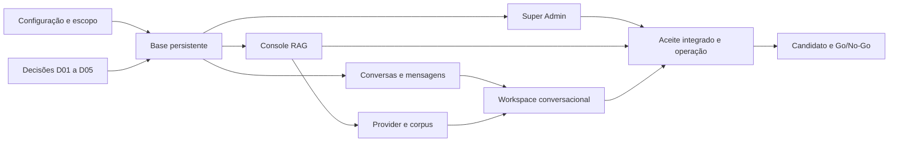

# Roadmap revisado — entregas verificáveis

**Revisão 2 — 08/09/2026.** [Plano executivo](plano-executivo-correcoes-2026-09-08.md) · [Backlog com dependências](backlog-correcoes-2026-09-08.md)

## 1. Marcos e demonstrações

| Marco | Itens | Resultado demonstrável | Saída obrigatória |
|---|---|---|---|
| M0 — Configuração e baseline | REC-01–04; preparar D01–D05 | navegação por permissão e diagnóstico do backend efetivo | testes locais identificados; config reproduzível; contrato por persona |
| M1 — Base de integração | REC-05–09 | login e dados persistentes em ambiente autorizado | migração repetível, sessão durável, auditoria de mutação |
| M2 — Super Admin | REC-10–13 | criar/editar/desativar usuário, recuperar acesso e revogar sessão pela UI | persistência após restart, tenant conforme política e negativos de acesso |
| M3 — Console RAG | REC-14–20 | gerir coleção e upload→job→publicação→busca→reindex/exclusão | fila externa/worker separado, Qdrant/embeddings reais, dois processos API, recovery e ACL |
| M4 — Geração e conversas | REC-21–27 | retomar conversa e obter resposta contextual com fontes e provider real | histórico durável, contexto multi-turn, streaming incremental, corpus avaliado |
| M5 — Aceite operacional | REC-28–32 | jornadas reais das três personas com observabilidade e recuperação | acessibilidade/review, restore, segurança multi-réplica, carga e custo |
| M6 — Candidato e promoção | REC-33–35 | rollout ensaiado e candidato identificável | manifesto e reviews atuais, Go/No-Go e rollout autorizado |

M4 inclui validação de apoio clínico conforme D04; funcionalidades fora do escopo aprovado precisam de alteração explícita da proposta, não de aceites silenciosamente omitidos.

## 2. Dependências e paralelismo real

O desenho mostra convergência dos marcos, não impõe espera por um marco inteiro. A ordem executável é dada pelos IDs no backlog: REC-17 pode começar com ambiente pronto; REC-18 depende de config/stores; REC-23 começa assim que DB/audit estiverem prontos. Telemetria pode ser preparada cedo e seu aceite integrado ocorre após composição. Propostas de decisão não aguardam testes locais.

Mudanças em contratos compartilhados têm um dono por vez. A separação por Backend/Web/Ops permite trabalho paralelo quando a API e o contrato de dados já estão definidos. Não se delega gravação concorrente em schema, configuration factory ou shell compartilhada.

## 3. Primeira sequência prática

1. Registrar os testes desta reanálise como baseline e tornar execução do harness identificável — REC-01.
2. Definir matriz das três personas e capacidades mínimas do root — REC-02.
3. Alinhar exemplo de configuração, leitura do root e diagnóstico do provider — REC-03.
4. Remover convites visuais a operações sem permissão — REC-04.
5. Levar propostas de tenant/IdP/infra/provider/corpus/SLO aos responsáveis.
6. Com ambiente e persistência prontos, entregar usuários pela UI — REC-10/11 — enquanto o caminho RAG/provider é composto.

Timeout do sandbox é limitação reproduzida do harness; só abre correção de aplicação caso nova evidência a demonstre. Não repetir matrizes completas sem alteração relevante apenas para produzir novas contagens.

## 4. Procedimentos de verificação

Comandos existentes para selecionar conforme superfície: `make validate`, `make api16-domain`, `make storage-test`, `make api16-root`, `make api15-full`, `make api-security`, `make web-validate`.

Antes de executar commands geradores como `api15-verify`, `api16-verify`, benchmarks e web evidence, conferir os paths de saída e preservar a evidência anterior. `make api-contract` regenera OpenAPI; comparar schema e registrar mudanças de contrato.

Para testes API: ambiente Python identificado, limite total com finalização dos processos próprios e uso autorizado fora do sandbox quando a espera TestClient/AnyIO reaparecer. Para browser: processo próprio, build com destino correto e origens permitidas. Nunca encerrar servidor alheio para liberar uma porta.

Novas suites live ainda precisam ser implementadas pelas tarefas correspondentes; não há comando existente presumido para Postgres/OIDC/queue completo. Cada suite deve cobrir sucesso, acesso indevido, falha parcial e recuperação com recursos sintéticos.

## 5. Gates e retomada

| Gate | Deve haver | Impede aprovação |
|---|---|---|
| Local | evidência de código/configuração e testes selecionados | falha sem classificação ou diferença de artefato |
| Piloto integrado | Super Admin, RAG e chat reais no ambiente autorizado | stub inesperado, perda de sessão/conversa/job, escopo incorreto |
| Produto | qualidade do corpus, jornadas, revisão visual/manual | fluxo crítico ausente ou resposta sem suporte no conjunto aprovado |
| Operação | restore, carga, alertas, falhas e release rehearsal | limite não definido ou obrigatório não executado |
| Produção | candidato selado e decisão dos responsáveis | P0 aberto, parecer ausente ou revisão diferente das evidências |

O piloto é uma avaliação controlada, não liberação para uso clínico real. Não há data de produção assumida; capacidade, decisões e resultados dos marcos determinarão previsão.

Retomada: ler a reanálise e backlog, inspecionar Git/estado canônico, selecionar a primeira tarefa cujas dependências tenham aceite, registrar próximo passo e evidência. Se alterar dados, executar o plano de migração compatível; se alteração de código/config for revertida, revalidar os contratos afetados. Candidato muda → evidências afetadas precisam ser renovadas.

## 6. Estado desta revisão

Execução iniciada por solicitação do usuário: M0 tem configuração, navegação e harness implementados localmente; M1 tem laboratório de dependências preparado, sem execução real. Docker/Compose estão instalados; o daemon permanece inacessível à sessão do agente. M1–M6 não têm aceite integrado. O [relatório de execução](../reports/execucao-planejamento-2026-09-08.md) registra verificações e bloqueios; `.agent/` é o controlador operacional.
