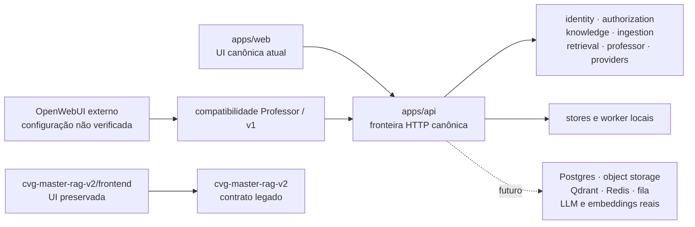
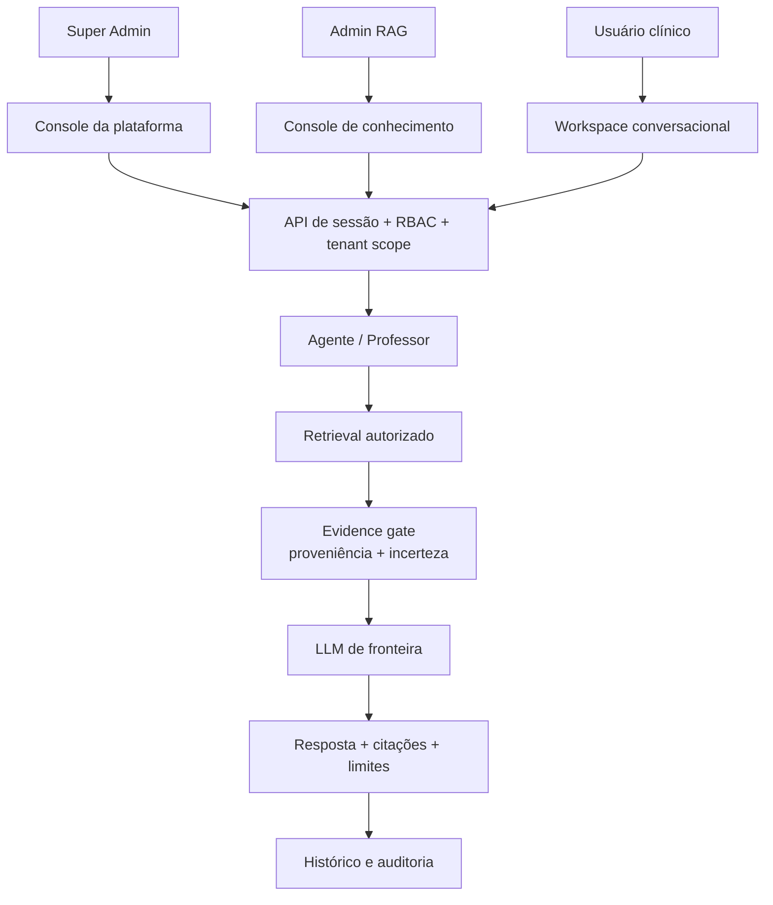

# Relatório de auditoria de funcionamento — RICK Intelligence

**Data:** 2026-09-08  
**Revisão auditada:** `66781cb`  
**Escopo:** aplicação canônica em `apps/web`, `apps/api` e `packages`, os componentes preservados em `cvg-master-rag-v2`, contratos de compatibilidade com OpenWebUI, documentação arquitetural, testes e renders reais.

## Veredito

O sistema tem uma base técnica local consistente, mas ainda não entrega o produto descrito. A entrega atual é um recorte de plataforma: autenticação, autorização, catálogo de documentos, ingestão local, busca, resposta com citações e uma página administrativa de saúde/auditoria. Ela não é ainda uma experiência equivalente ao OpenWebUI, não oferece o console de Super Admin esperado e não está comprovadamente conectada a uma LLM de fronteira no caminho usado pela interface canônica.

Minha decisão para o objetivo informado é **NO-GO funcional**. O backend local passa seus contratos principais; o produto permanece incompleto nas três áreas que definem o valor para você: administração de usuários, gestão operacional da base RAG e espaço conversacional clínico conectado a um modelo real.

A sensação de estar usando uma landing page foi confirmada pela inspeção visual. A tela de login usa uma composição de marca com uma mensagem institucional; a área de trabalho é um workbench de evidências com pouca densidade; a conversa é um formulário de pergunta com um painel de resposta; e `/admin` mostra somente duas placas, saúde e auditoria. São telas organizadas, mas não formam a aplicação operacional que foi planejada.

## Como o programa foi concebido

Há duas linhas de produto no repositório.

`apps/web` é declarado como o caller visual canônico desta fase. Ele não importa a interface do `cvg-master-rag-v2`; as duas superfícies continuam falando contratos diferentes. O root também expõe endpoints compatíveis com OpenAI em `/v1`, mas isso é uma fronteira de compatibilidade e não transforma a interface nativa em OpenWebUI.

O documento de arquitetura alvo descreve uma plataforma com duas experiências: `/app` para o workspace clínico e `/admin` para administração e gestão de conhecimento. Esse alvo é marcado como `PROPOSED`; o código atual implementa apenas uma parte de cada experiência. A separação de três blocos que você descreveu deve ser entendida como três contextos de responsabilidade dentro de uma plataforma única:

| Bloco esperado | Papel canônico atual | O que deveria controlar | O que existe hoje no root |
| --- | --- | --- | --- |
| **Super Admin** | `PLATFORM_ADMIN`, alias legado `super_admin` | tenants, usuários, papéis, sessões, segurança, runtime, auditoria e governança geral | API lista e cria usuários no mesmo tenant; a UI não oferece usuários, tenants, papéis ou sessões |
| **Admin RAG** | `KNOWLEDGE_MANAGER`, alias legado `admin_rag` | documentos, coleções, ingestão, jobs, reindexação, qualidade do corpus, avaliação e configuração de retrieval | `/app/documents` oferece parte do ciclo de documentos; `/admin` oferece apenas saúde e auditoria |
| **Usuário clínico** | `VETERINARIAN`, alias legado `viewer` | conversa, histórico próprio, fontes autorizadas, análise de caso e perfil | consulta de uma pergunta por vez com citações; não há histórico conversacional na interface nem fluxo de caso clínico |

O backend usa autorização por permissão e escopo de tenant. Essa é uma boa base: a permissão deve ser decidida no servidor, e a interface apenas deve apresentar a superfície correta. A separação visual atual ainda não acompanha essa regra.

## Funcionamento observado por fluxo

| Fluxo | Estado observado | Evidência e limite |
| --- | --- | --- |
| Login e sessão | **CURRENT / PASS local** | Login, cookie, `/auth/me` e logout funcionam no ambiente local. A identidade local usa usuários demonstrativos em memória. |
| Recuperação de acesso | **CURRENT / INCOMPLETO** | A tela oferece um `mailto`; os endpoints de solicitação retornam `queued`, mas a confirmação de token sempre retorna token inválido. Não é um fluxo de recuperação utilizável. |
| Autorização | **CURRENT / PASS na API** | `PLATFORM_ADMIN`, `KNOWLEDGE_MANAGER` e `VETERINARIAN` possuem conjuntos de permissões distintos; a API retorna `403` para operações indevidas. |
| Cadastro de usuário | **CURRENT / PARCIAL** | `GET` e `POST /api/v1/admin/users` existem para o Super Admin e filtram o tenant. Não há formulário no front canônico, nem edição, desativação, exclusão ou reset de senha. |
| Tenants | **CURRENT / AUSENTE no root** | Não há CRUD de tenants na API canônica nem na UI canônica. A criação fica restrita ao mesmo tenant do ator. |
| Catálogo e upload | **CURRENT / PASS local** | `/app/documents` lista documentos, coleções e jobs e permite upload, retry, cancelamento, reindexação e exclusão conforme as permissões. |
| Pipeline RAG | **CURRENT / LOCAL** | O pipeline local passa por validação, parsing, chunking, embeddings, indexação, verificação e publicação. O worker e o armazenamento são processuais ou SQLite opcional. |
| Retrieval | **CURRENT / PASS hermético** | Há filtros de tenant/coleção, ranking e citações. O ambiente verificado usa corpus e embeddings locais determinísticos; equivalência semântica com Qdrant e embeddings reais não foi executada. |
| LLM | **CURRENT / STUB** | `RICK_API_CHAT_BACKEND` tem `stub` como padrão. O smoke test retornou `Resposta fundamentada (stub)`, portanto a resposta observada não foi gerada por uma LLM de fronteira. |
| Professor / provider real | **IMPLEMENTADO ATRÁS DE CONFIGURAÇÃO / NOT_RUN** | Existe caminho `professor` e adaptadores de provider, mas não houve chamada verificada a OpenAI ou a um endpoint compatível com credencial real. |
| Chat | **CURRENT / PASS técnico, INADEQUADO ao produto** | A API retorna `conversation_id`, resposta, citações e metadados. A UI força `stream: false`, não mostra lista de conversas e perde a experiência contínua do OpenWebUI. |
| Histórico | **CURRENT / API sem produto** | Existem endpoints de histórico e persistência best effort no serviço; `apps/web/lib/api.ts` não oferece chamada de histórico e o chat não apresenta conversas anteriores. |
| Administração | **CURRENT / INSUFICIENTE** | `/admin` consulta `/admin/health` e `/admin/audit`. O próprio rodapé informa que operações de job ficam em Documentos e que a página é somente consulta. |
| OpenWebUI | **CURRENT / NÃO UNIFICADO** | O repositório preserva compatibilidade e componentes legados, mas a UI nativa root é uma aplicação Next própria, com modelo de interação diferente. |

## Achados da auditoria

Os estados usam `CURRENT` para comportamento observado, `PROPOSED` para alvo de arquitetura, `NOT_RUN` para integração não executada e `UNKNOWN` para informação que não está disponível no repositório ou no ambiente local.

| ID | Prioridade | Achado | Impacto | Confiança |
| --- | --- | --- | --- | --- |
| `RICK-FUNC-001` | **P0** | O root canônico é uma fatia inicial, enquanto a documentação alvo descreve uma plataforma completa. | O usuário entra em uma aplicação que não contém as capacidades esperadas; a diferença não é apenas estética. | Alta |
| `RICK-FUNC-002` | **P0** | A interface canônica usa o backend `stub` por padrão. | Não existe assistência clínica por LLM de fronteira no caminho padrão; a frase de resposta é demonstrativa e não tem qualidade clínica. | Alta |
| `RICK-FUNC-003` | **P0** | O Super Admin não possui uma tela de usuários. | Não é possível cadastrar um novo usuário pelo programa, embora exista uma rota de API parcial. | Alta |
| `RICK-FUNC-004` | **P0** | O console de Admin RAG não foi entregue como console. | Não há uma área central de governança que reúna coleções, jobs, qualidade do corpus, avaliação, configurações de retrieval, segurança e operação; parte do ciclo está espalhada em Documentos. | Alta |
| `RICK-ARCH-005` | **P0** | Existem duas linhas de frontend e contrato: root canônico e CVG preservado. | Capacidades que já existem no legado não chegam ao usuário do root; continuar adicionando telas sem escolher uma linha mantém o produto dividido. | Alta |
| `RICK-FUNC-006` | **P1** | O chat root é uma consulta isolada, não um workspace conversacional. | Faltam sidebar de conversas, histórico, streaming, continuidade de contexto, escolha de agente/modelo e um fluxo de caso clínico. | Alta |
| `RICK-UX-007` | **P1** | A navegação do usuário clínico inclui `Documentos`, apesar de a API negar o catálogo para `VETERINARIAN`. | A pessoa acessa um item que termina em `403`, o que transmite erro de produto mesmo com a autorização do servidor correta. | Alta |
| `RICK-SEC-008` | **P1** | Recuperação de acesso e administração de identidade estão incompletas. | O usuário não consegue recuperar a conta de forma autônoma; o ciclo de vida da identidade depende de integração externa ainda não comprovada. | Alta |
| `RICK-OPS-009` | **P1** | Jobs, identidade, auditoria e stores locais não comprovam operação durável. | Reinício, múltiplas instâncias, recuperação de fila, retenção e escala não estão garantidos para uso real. | Alta |
| `RICK-CONFIG-010` | **P1** | O `.env.example` usa nomes `LLM_*`, enquanto o root lê `RICK_API_CHAT_BACKEND`, `EXTERNAL_CHAT_API_KEY` e `OPENAI_*`. | Uma configuração aparentemente preenchida pode continuar usando o stub, criando falsa impressão de que a LLM está conectada. | Alta |
| `RICK-TEST-011` | **P2** | A validação local reaproveita servidor existente e é sensível à origem CSRF e ao destino gravado no build. | Um processo antigo na porta 8000 produziu três falhas de chat; com API nova, origem autorizada e build recompilado, a matriz passou. | Alta |
| `RICK-VIS-012` | **P1** | A página `/admin` tem baixa densidade operacional e não comunica controle de plataforma. | Mesmo quando tecnicamente verde, a tela parece incompleta porque mostra somente saúde e auditoria em dois cartões. | Alta |

## O que foi verificado

### API e domínio

`make api16-full` foi executado com sucesso:

- limites e control plane: **PASS**;
- conhecimento, ingestão e retrieval: **104 passed**;
- worker e health: **35 passed**;
- suíte root da API: **358 passed**;
- benchmark local: 30 amostras, com p50/p95 de upload, enqueue e retrieval dentro dos limites registrados.

Esse resultado confirma contratos locais, autorização, filtros de escopo, ciclo de ingestão hermético e tratamento de erros. Ele não comprova provider externo, Qdrant, Redis, object storage, fila durável, Postgres ou operação multi-instância; essas dependências ficaram `NOT_RUN`.

### Frontend e navegador

O build passou, e a matriz de navegador repetida com API nova, origem permitida e build apontando para a porta correta terminou com **234/234 testes passados** em 375, 768 e 1440 px. Os 18 registros de performance locais também passaram os limites atuais, com máximo observado de LCP de 612 ms e CLS de 0,0245569.

Uma execução anterior no processo já ativo em `:8000` terminou com 231/234 porque três cenários de chat receberam `403`. O trace mostrou `Origin: http://127.0.0.1:3010` e o processo reaproveitado não tinha essa origem configurada. A repetição em ambiente novo passou; o achado é de higiene de execução e configuração, não uma confirmação de que a experiência esteja pronta.

### Smoke test no limite HTTP

No processo local da API, observei:

- `/health/live` e `/health/ready`: `200`;
- login de Super Admin, Admin RAG e usuário clínico: `200`;
- Super Admin listando usuários: `200`, três identidades locais;
- Admin RAG e usuário clínico tentando administrar usuários: `403`;
- Admin RAG consultando o chat: `200`, uma citação local e metadado `backend: stub`.

Esse teste confirma que a autorização atual está coerente com a política declarada. Ele também confirma o problema de produto: a resposta funciona, mas é uma resposta demonstrativa local, não uma geração clínica por LLM de fronteira.

### Inspeção visual real

Os renders foram inspecionados no navegador, não inferidos apenas do CSS:

- [login desktop](../../.gauntlet-state-of-art/evidence/visual-cycle5-current/production-test-results/custom-login-default-desktop.png): composição de marca e acesso, com linguagem de apresentação institucional;
- [workspace desktop](../../.gauntlet-state-of-art/evidence/visual-cycle5-current/production-test-results/custom-workbench-success-desktop.png): pergunta principal, dois atalhos e fatos do espaço, com grande área sem conteúdo operacional;
- [chat desktop](../../.gauntlet-state-of-art/evidence/visual-cycle5-current/production-test-results/custom-chat-response-desktop.png): formulário à esquerda e leitura à direita, sem histórico ou continuidade de conversa;
- [admin desktop](../../.gauntlet-state-of-art/evidence/visual-cycle5-current/production-test-results/custom-admin-allowed-desktop.png): estado das dependências e trilha de auditoria, sem gestão de usuários, tenants ou RAG.

Os testes confirmam acessibilidade, reflow, foco e estados técnicos. Eles não podem transformar uma página vazia em um console completo; esse é o motivo para separar qualidade de implementação de completude do produto.

## Pontos de inspeção no código

As fontes abaixo permitem revisar as conclusões sem depender apenas deste texto:

- [arquitetura alvo](../../docs/architecture/target-system.md): separa `/app` e `/admin`, mas marca o sistema como `PROPOSED`;
- [web canônica](../../docs/architecture/canonical-web.md): lista as rotas que o root realmente consome e registra `/admin` como saúde/auditoria;
- [matriz de acesso](../../docs/architecture/security/ui-access-matrix.md): define que o usuário clínico não deve receber catálogo, upload ou administração;
- [shell canônica](../../apps/web/components/app-shell.tsx): navegação atual e guarda visual por papel;
- [página administrativa root](../../apps/web/app/admin/page.tsx): somente health e audit;
- [cliente API root](../../apps/web/lib/api.ts): não possui operações de usuários nem histórico no frontend;
- [rotas administrativas](../../apps/api/src/routes/admin.py): listagem/criação parcial de usuários, sessões vazias e jobs processuais;
- [serviço de chat](../../apps/api/src/services/chat_service.py): `StubChatBackend` determinístico e sem chamadas ao provider;
- [admin legado](../../cvg-master-rag-v2/frontend/app/admin/page.tsx): demonstra a superfície de tenants, usuários, edição, remoção e avaliação que ficou fora do root.

## Arquitetura que deve ser construída

Esta é uma proposta de correção, não uma descrição do estado atual.

O fluxo correto para o usuário clínico é:

1. a sessão autentica identidade, tenant, workspace e permissões;
2. o usuário cria ou retoma uma conversa;
3. o agente recebe a pergunta e o contexto clínico permitido;
4. o retrieval filtra documentos pelo escopo do servidor;
5. o sistema bloqueia ou sinaliza respostas sem evidência suficiente;
6. a LLM recebe somente o contexto autorizado e devolve resposta, fontes, incerteza e próximos passos;
7. pergunta, resposta, fontes e decisão de escopo ficam no histórico e na auditoria apropriados.

Para apoio a casos clínicos, o agente deve trabalhar com evidência, hipótese, incerteza e revisão humana. A meta não deve ser “alucinar” uma conduta; deve ser auxiliar a análise sem transformar uma saída sem fonte em decisão.

### Contratos mínimos por bloco

**Super Admin** precisa de usuários, convite ou criação, edição de papel, ativação/desativação, reset de senha, tenants, sessões, permissões, auditoria, health, configurações do provider e diagnóstico de runtime. Cada operação deve ter escopo, confirmação quando destrutiva e evento auditável.

**Admin RAG** precisa de coleções, fontes, versões de documentos, upload, parsing, jobs, retry, cancelamento, reindexação, publicação, despublicação, integridade do corpus, avaliação de retrieval, thresholds, observabilidade e configuração explícita de embeddings e reranker.

**Usuário clínico** precisa de lista de conversas, nova conversa, streaming, fontes expansíveis, histórico próprio, busca de conversas, seleção clara do agente, contexto do caso, resumo, hipóteses, evidências a favor e contra, alertas de incerteza e retorno para revisão. A UI não deve mostrar catálogo ou operações que o papel não pode executar.

## Plano de correção recomendado

| Ordem | Entrega | Critério de aceite |
| --- | --- | --- |
| 1 | Escolher uma linha canônica e congelar a duplicidade root/legado | Existe uma única rota de produto documentada; o legado vira adapter ou é aposentado por decisão explícita. |
| 2 | Entregar o Super Admin ponta a ponta | Usuário com papel `PLATFORM_ADMIN` consegue listar, criar, editar, desativar e resetar usuários, gerir tenants e consultar sessões/auditoria pela UI; API e testes cobrem isolamento de tenant. |
| 3 | Entregar o console Admin RAG | Admin consegue operar coleção, corpus, ingestão, jobs, reindexação, avaliação, retrieval e saúde em uma área própria; cada operação mostra estado confirmado pelo servidor. |
| 4 | Ligar provider real em ambiente de integração | O caminho `professor` chama uma LLM compatível, com timeout, rate limit, lease, segredo fora do código, health explícito e evidência de resposta real. O stub permanece apenas em testes/local. |
| 5 | Reconstruir o workspace conversacional | Conversas persistentes, streaming, histórico, fontes, contexto do caso e estados de incerteza funcionam em desktop/tablet/mobile. A experiência deve se aproximar do modelo de interação do OpenWebUI, mantendo o domínio veterinário. |
| 6 | Tornar a plataforma durável | Identidade, Postgres, object storage, Qdrant, Redis/locker, fila e worker estão ligados; restart, retry, backup/restore e duas instâncias são verificados. |
| 7 | Fazer o aceite visual e clínico | Uma pessoa responsável pelo produto valida renders, densidade, linguagem e fluxo de caso com corpus representativo; revisão clínica e segurança permanecem requisitos de release. |

A primeira correção de maior retorno é a entrega do fluxo Super Admin completo, porque ela revela a arquitetura de identidade, o contrato de tenant e a navegação por papel. Em seguida deve ser conectado o provider real; polir a aparência antes desses dois pontos manteria a sensação de protótipo.

## Limitações e informações ainda desconhecidas

- `UNKNOWN`: versão, configuração e modelo de autenticação do OpenWebUI que você usava;
- `UNKNOWN`: provider, modelo, credencial e endpoint que deveriam ser considerados a LLM de fronteira;
- `NOT_RUN`: chamadas reais de LLM, Qdrant, Redis, object storage, Postgres e fila;
- `NOT_RUN`: avaliação semântica com corpus veterinário aprovado e conjunto de casos clínicos;
- `NOT_RUN`: backup/restore, carga, soak, failover e operação multi-instância;
- o smoke test local usa identidades e corpus demonstrativos; não é evidência de prontidão clínica ou regulatória;
- os testes visuais validam comportamento e renders locais, não aceitação estética independente nem qualidade de resposta clínica.

## Conclusão operacional

O programa não está quebrado em um único ponto. Ele foi entregue em uma fase intermediária como fundação técnica, enquanto a expectativa era de uma plataforma pronta com três áreas funcionais e uma experiência conversacional madura. As correções precisam começar pela decisão de produto e pelos contratos de administração, RAG e chat; a interface visual será consequência de uma arquitetura com conteúdo e operações reais.

**Próxima ação recomendada:** usar este relatório como baseline e transformar os itens `RICK-FUNC-003`, `RICK-FUNC-004` e `RICK-FUNC-002` em uma primeira especificação executável, nessa ordem: Super Admin, console RAG e provider real.
